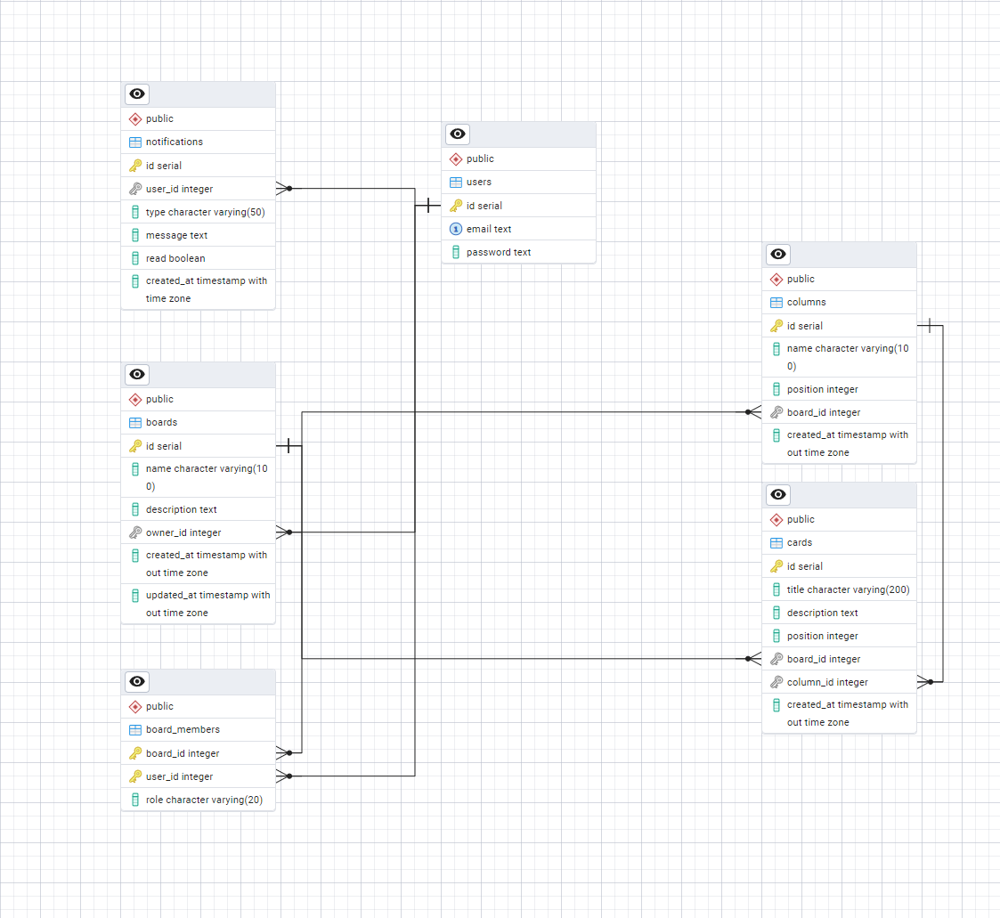

# Kanban Board Application

## Database Schema


## How to Run
1. Clone the repository
2. Create a `.env` file in the root directory with:
   ```
   # DB Configuration
   POSTGRES_USER=postgres
   POSTGRES_PASSWORD=your_password
   POSTGRES_DB=kanban-board
   POSTGRES_HOST=localhost
   POSTGRES_PORT=5432

   JWT_SECRET=your_secret
   # node -e "console.log(require('crypto').randomBytes(64).toString('hex'))"

   # Frontend Configuration
   VITE_API_URL=http://localhost:3000
   VITE_BOARD_SERVICE_URL=http://localhost:3001
   ```
3. Run with Docker:
   ```bash
   docker-compose up --build
   ```
4. Access the application at http://localhost:5173

## Project Structure
```
kanban-board/
├── client/              # React frontend
├── services/            # Backend services
│   ├── auth-service/    # Authentication service
│   ├── board-service/   # Board management service
│   └── db/             # Database initialization
├── docs/               # Documentation
└── docker-compose.yml  # Docker configuration
```